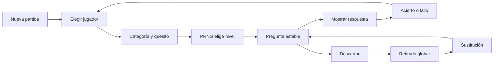

# Trivial

Aplicación web multijugador para partidas presenciales. Los CSV del repositorio son la semilla canónica y SQLite conserva en el servidor partidas, eventos, descartes y proyecciones. El navegador no guarda estado de juego canónico.

## Puesta en marcha

Requiere Python 3.11 o posterior. No hay dependencias de producción.

```bash
export TRIVIAL_ADMIN_TOKEN='una-frase-larga-y-aleatoria'
export TRIVIAL_SECURE_COOKIE=false
python3 run.py --host 127.0.0.1 --port 8080
```

Abrir `http://127.0.0.1:8080`. En producción debe publicarse detrás de un proxy HTTPS y mantenerse `TRIVIAL_SECURE_COOKIE=true`.

Con Docker:

```bash
cp .env.example .env
docker compose up -d --build
```

El volumen `trivial-data` contiene `trivial.sqlite3`. Debe incluirse en la política de copias del servidor.

## Flujo



## Garantías principales

- Una sola pregunta pendiente por partida.
- Jugador elegido explícitamente; no hay rotación automática.
- Nivel elegido antes de la pregunta mediante PRNG determinista.
- Pesos congelados por partida; los niveles agotados se excluyen conservando las proporciones relativas restantes.
- Pregunta de menor `order_key` dentro del nivel.
- Descartes globales, atómicos y con sustitución del mismo nivel cuando existe.
- Event sourcing append-only, undo/redo semántico e idempotencia.
- SQLite en WAL, transacciones `BEGIN IMMEDIATE`, sesiones HttpOnly y permisos por partida.
- CSV estrictos, actualización automática de semilla y partidas web preservadas.
- Estadística con IC de Wilson, Fisher bilateral, corrección de Holm y bondad de ajuste.
- Backups JSON validados antes de escribir y reset exacto a los CSV actuales.

## Comandos

```bash
npm ci
npm test
npm run test:e2e
python3 scripts/package-release.py dist/trivial-server.zip
```

La especificación completa está en `docs/`.
